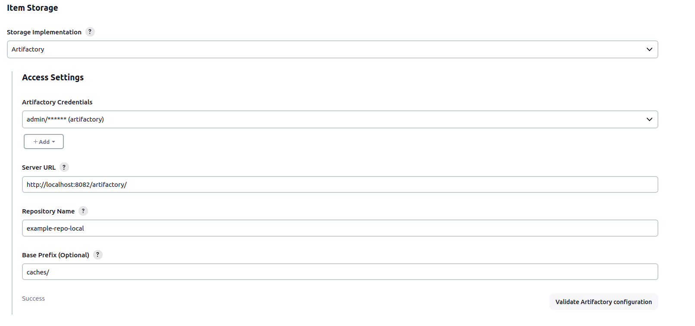
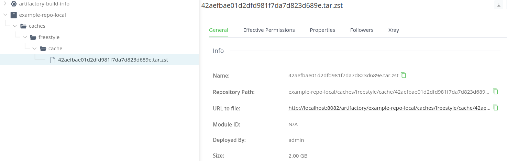

# Jobcacher Artifactory storage Extension plugin

This plugin is an extension of the [jobcacher-plugin](https://plugins.jenkins.io/jobcacher/) that allows you to store the cache in JFrog Artifactory.

> [!NOTE]
> This plugin is maintained by the Jenkins Community and not by JFrog.

<p align="center">
  
</p>

The plugin support both OSS and Pro versions of Artifactory, but Pro version is recommended due to missing REST API on OSS edition.

> [!IMPORTANT]
> Limitations of OSS edition.

- Not able to move caches to another location when a job is renamed. Moving must be done manually from Artifactory UI (which is supported on OSS edition).

## Introduction

## Getting started

You only need to configure the extension to use Artifactory under System Configuration.



## Configuration as Code

```yaml
unclassified:
  globalItemStorage:
    storage:
      artifactory:
        prefix: "jenkins/"
        repository: "my-generic-repo"
        serverUrl: "http://localhost:7000"
        storageCredentialId: "the-credentials-id"
```

Caches will be stored artifactory with the following structure:



See [jobcacher-plugin](https://plugins.jenkins.io/jobcacher/) for usage in jobs and pipelines.

## CONTRIBUTING

See [CONTRIBUTING](CONTRIBUTING.md)

## LICENSE

Licensed under MIT, see [LICENSE](LICENSE.md)

